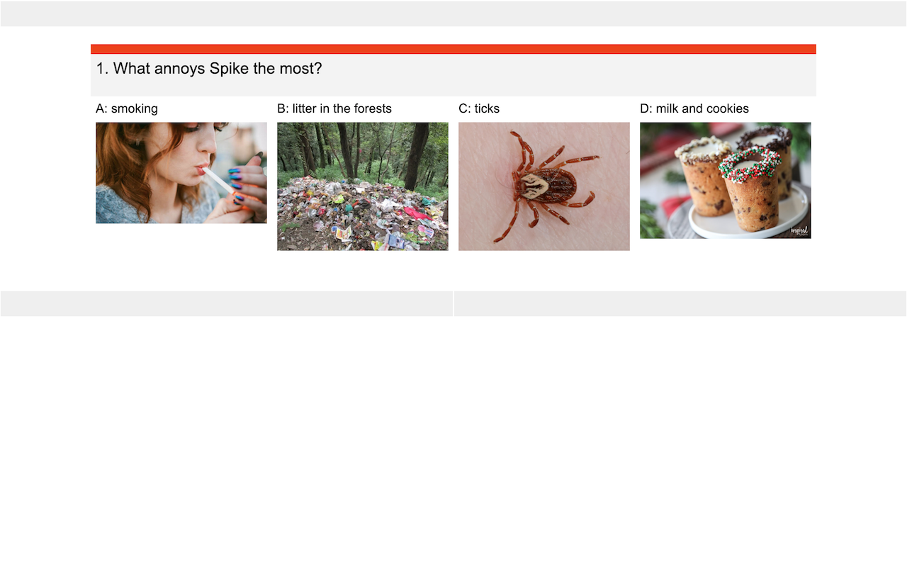

<!-- README.md is generated from README.Rmd. Please edit that file -->

# peRson 

<!-- badges: start -->

[](https://www.tidyverse.org/lifecycle/#experimental)
<!-- badges: end -->

The goal of peRson is to learn about people in your life with a fun
personal quiz. All you need is R, Google Sheets and video conferencing.
Quarantine and long-distance friendly! :)

## Installation

You can install the released version of peRson from
[Github](https://www.github.com/) with:

``` r
remotes::install_github("martina-starc/peRson")
```

## Example quiz pages





