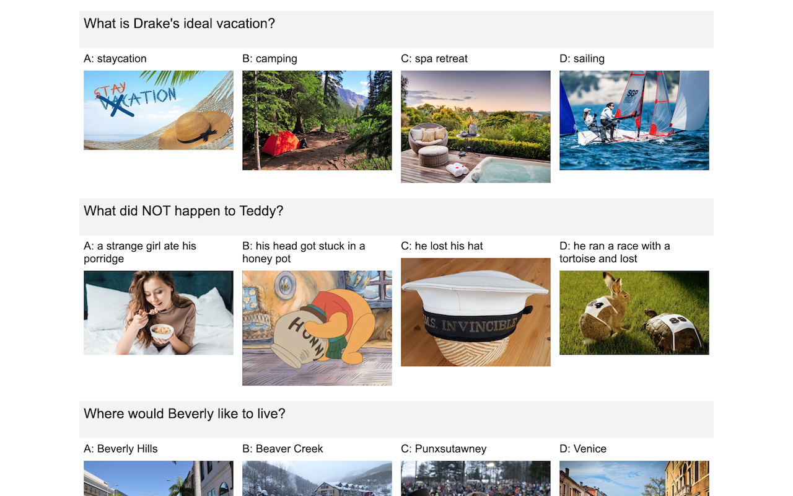
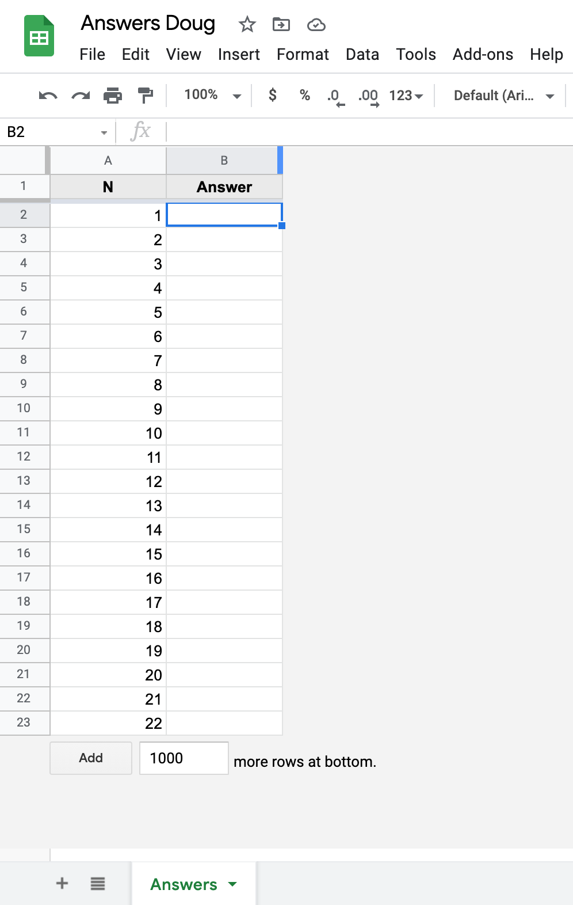
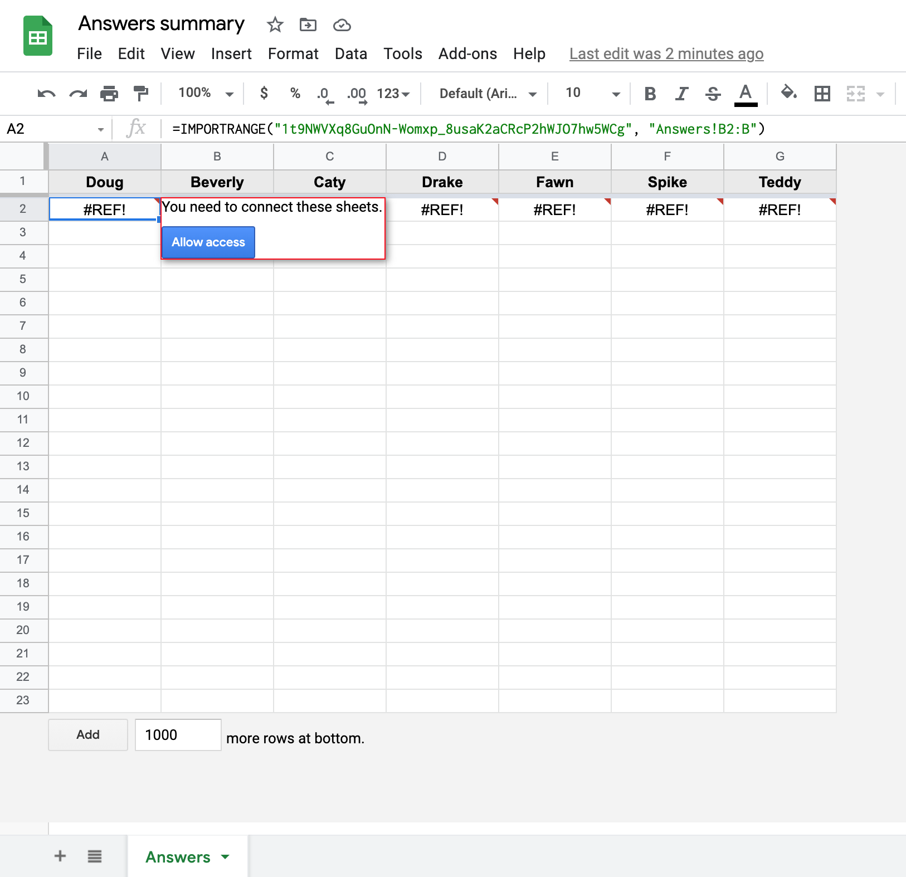
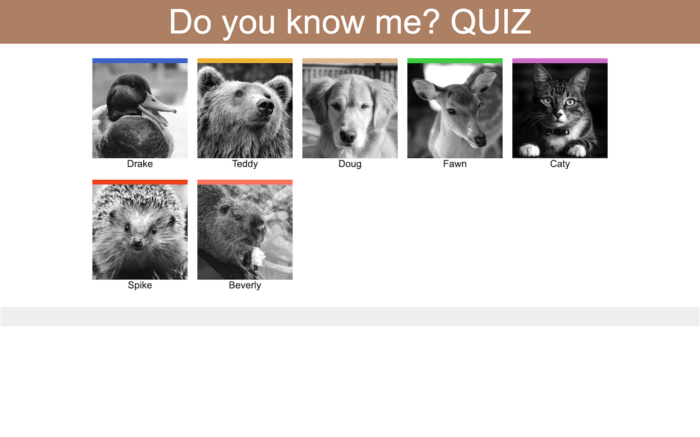
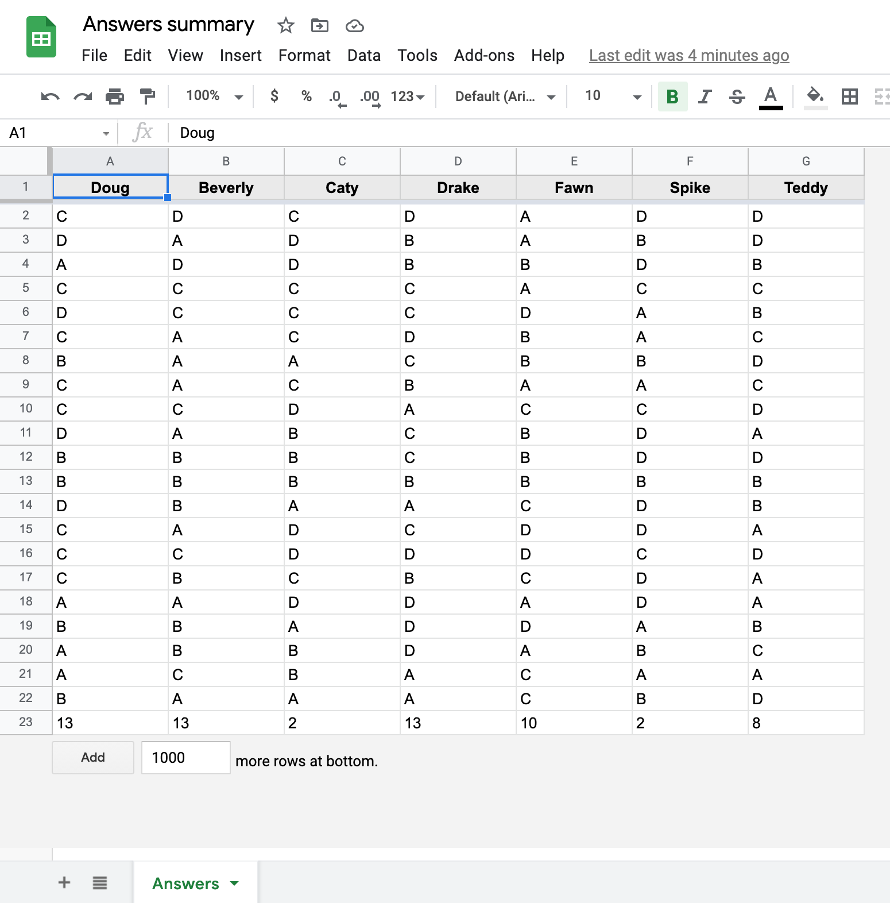
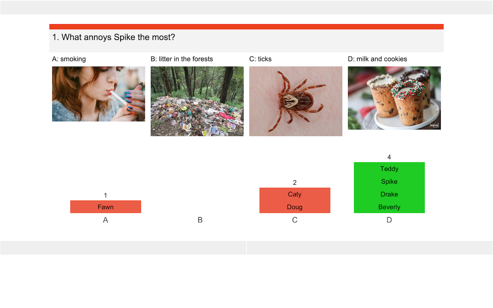
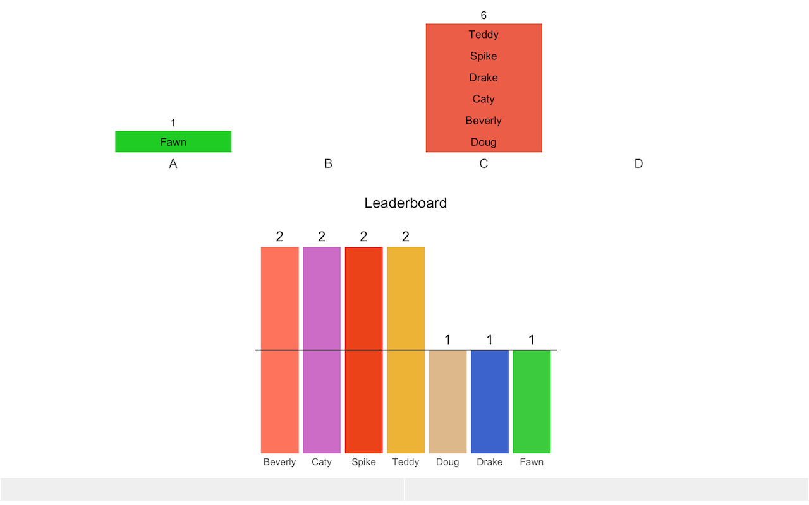
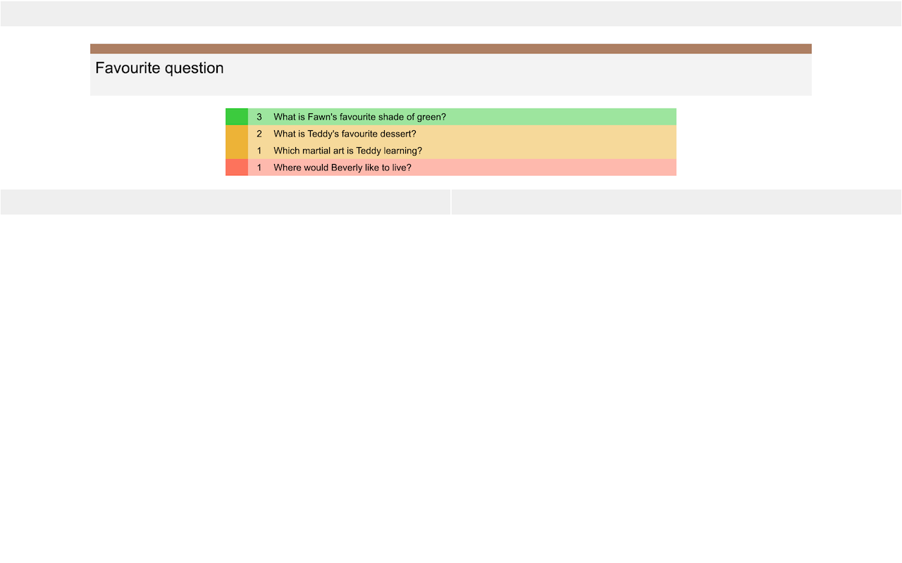

```{css, echo=FALSE}
img {
  padding: 0;
  display: block;
  margin: 0 auto;
  max-height: 100%;
  max-width: 100%;
}
```
```{r, echo = FALSE}
knitr::opts_chunk$set(
  collapse = TRUE,
  comment = "#>"
)
```
## Preparation
To set up your quiz, you'll first need to prepare data frames with your participants and the questions they provided. You can check the proper format in the demo datasets.
```{r}
library(peRson)
demo_participants
```
Each participant needs a name, a color they can choose from `colors()`, a path to their photo and their email address. Participants' images will look best if they are square and in grayscale.
```{r}
demo_questions
```
Each participant should send some questions about themselves and provide 4 alternative answers. But they don't need to tell you the correct answer. That means that you can also participate in the quiz. 

The questions data frame should contain:

* **person:** name of the person asking the question - it should match the name in the participants data frame
* **text:** question text containing the name of the person (i.e. What is Caty's favourite book?)
* **answer_A-answer_D:** 4 alternative answers to the question
* **image_A-image_D:** 4 images to illustrate the answers (optional, can be left blank, but the columns still need to be included in the data frame)

Participants can choose their own question images. You need to make sure that the link works or, if they send files, to input the correct path. The quiz will be created in a quiz subfolder in your working directory, it's easiest if you put the images in there as well.

For now, let's work with the demo data to set up our first quiz. For the demo images to correctly display on your local machine, use `get_demo_participants`. The function will get the correct paths to the images. 

```{r}
participants <- get_demo_participants()
```
If participants didn't provide all the images and you don't want to add them manually, you have the option of replacing missing images with results from Bing with `add_bing_images`. The function returns the first image it finds by using the answer as a search term. It takes a while to get all the results, so it's advisable to prepare this in advance and save the results for later. 
```{r, eval = FALSE}
# All code examples below are not run. 
questions <- demo_questions %>%
  add_bing_images()
preview_images(questions)
browseURL("quiz/preview_images.html")
```
You can preview all the images with `preview_images`. This will create a page preview_images.html in the quiz folder. Open it and inspect the results. Some images might be missing if Bing still has them cached, but they're gone from the original site and some images might be inappropriate. You can replace them manually in the data frame as needed.



## Quiz time!

### Quiz setup
Once you're ready to start your quiz, run `quiz_setup`. You'll need to provide your prepared questions and participants data frames. Additionally, if somebody couldn't make it to the quiz, supply a character vector of present participants. This will ensure that only questions from present participants are included in the quiz. 

By default, the answers (which answer is under which letter) and the order of the questions will be shuffled in rounds (each round will contain one question from each participant). But if you want to control the order of questions and answers, you can turn this off. 

`quiz_setup` will create answer sheets on your Google Drive so you'll need to authenticate in this step. It will give each participant write access to their sheet. 



If you keep the create_sheets option on in the demonstration, the sheets will be shared with fake emails in `demo_participants` so expect to see some mail delivery failure emails in your inbox. :) Alternatively, you can overwrite the email column in the participants data frame with your real email address, just to test that everything works.
```{r, eval = FALSE}
quiz <- quiz_setup(questions, participants)
as.list(quiz)
options(peRson.quiz = quiz)
```
`quiz_setup` will prepare all the data necessary to create quiz pages and save it into the quiz environment. Save the environment and assign it as a global option. The quiz functions will be able to access the environment via global options and you won't have to include it in the arguments. You can check what was done by listing the variables in the environment.

In addition to participants' answer sheets, a summary sheet with imported answers from individual sheets will be created. However, in order for the imports to work, you'll need to go to your drive, open the summary sheet and manually link the sheets. 



You can do this while your participants check their emails and open their answer sheets. The imports are an extra step, but this has the advantage of only accessing one sheet when you evaluate answers and you can also check it during the quiz to see when all participants have answered the questions (with a bit of lag).


### Create quiz pages
`show_contestants` will create the intro page of the quiz (Q0.html) with participants' images and colors.
```{r, eval = FALSE}
show_contestants()
```


Next, create the question pages with `create_question`. You can do it in a loop to create them all in one step. In our example, the function will create pages Q1.html-Q21.html.
```{r, eval = FALSE}
purrr::walk(1:nrow(quiz$questions), create_question)
```


You can also already create a page for favourite question (Q22.html). If for some reason you need to cut the quiz short, you can run it again before ending the quiz. 
```{r, eval = FALSE}
favourite_question(nrow(quiz$questions))
```


Alternatively, you can do these three steps with `create_quiz_pages`.
```{r, eval = FALSE}
create_quiz_pages()
```


Just for the purpose of demonstration, we will fill the demo answers sheets with all the answers, but of course in the real quiz you don't have to do this step, because your participants will enter answers during the quiz. 
```{r, eval = FALSE}
fill_demo_answer_sheets()
```



### Start the quiz
Start the quiz by opening Q0.html and sharing the screen with your participants. The first page will show their pictures and colors. Click on the navigation bar at the bottom of the page to progress to the first question.
```{r, eval = FALSE}
browseURL("quiz/Q0.html")
```
To answer the question, participants should enter their answer in the answer sheets using capital letters A-D (as should you in your own sheet). You will see their answers appear in the summary sheet. The person who provided the question should also enter their answer - their answer will be used to evaluate the correctness.

Once everyone has answered, run the `evaluate_answers` function in your R session. The function will read the summary sheet, match the question to the person asking, and compare the answers to their answer. An image A1.png will be created with the results. 
```{r, eval = FALSE}
evaluate_answers()
```


Go back to the browser and refresh the page (either with the browser key or by clicking on the navigation bar above the question). The image with the results will appear under the question. Move on to the next question, wait for the answers, then run `evaluate_answers` again. Repeat to the end of the quiz. 

Every fourth question a leaderboard image (for example L4.png) will be created and shown under the results image.



Here we'll just map over the questions in the quiz, so you can check everything works (some sleep is included because otherwise your Read requests per minute quota could be exhausted).
```{r, eval = FALSE}
purrr::walk(2:21, function(n) { 
  Sys.sleep(1)
  evaluate_answers()
})
```

When you get to the favourite question page, participants choose their favourite question and put its number in the answer sheet. To evaluate and create the results page, run `favourite_result`. 
```{r, eval = FALSE}
favourite_result()
```


Finally, run `final_results` to create the final page of the quiz. Participants will be awarded badges for winner, top 3, answering above random, etc. Hover over the badges to see the badge description.
```{r, eval = FALSE}
final_results()
```


That's it! I hope you'll have fun putting together this quiz! 

### Clean up
The quiz will remain in the quiz folder you can keep it or delete it manually. But if you don't want to keep answer sheets, you can trash the answer sheets from your Google Drive with `quiz_clean_drive`.
```{r, eval = FALSE}
quiz_clean_drive()
```


